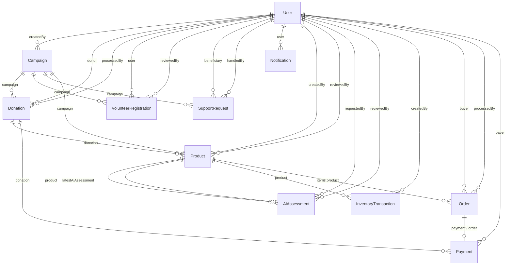

# ReGive — Database (MongoDB / Mongoose)

> Nguồn: `backend/src/models/*` + `backend/src/constants/enums.js`  
> Phiên bản: 1.0 — 10/09/2026  
> Lưu ý: MongoDB **không enforce FK**. `ref` là ràng buộc ứng dụng (Mongoose populate). Integrity do service đảm bảo.

**11 collections:** `User` · `Campaign` · `Donation` · `VolunteerRegistration` · `SupportRequest` · `Product` · `AiAssessment` · `InventoryTransaction` · `Order` · `Payment` · `Notification`

Mọi collection đều có `_id` (ObjectId, PK) và `createdAt` / `updatedAt` (`timestamps: true`).

---

## 1. Sơ đồ quan hệ



---

## 2. Cardinality & FK

| From | Field | To | Card. | Bắt buộc | Ghi chú |
|---|---|---|---|---|---|
| Campaign | `createdBy` | User | N:1 | Có | Người tạo chiến dịch |
| Donation | `donor` | User | N:1 | Có | Người quyên góp |
| Donation | `processedBy` | User | N:1 | Không | Employee/Admin xử lý |
| Donation | `campaign` | Campaign | N:1 | Có | Luôn gắn 1 campaign |
| VolunteerRegistration | `user` | User | N:1 | Có | Unique cùng `campaign` |
| VolunteerRegistration | `campaign` | Campaign | N:1 | Có | Unique cùng `user` |
| VolunteerRegistration | `reviewedBy` | User | N:1 | Không | Người duyệt |
| SupportRequest | `beneficiary` | User | N:1 | Có | Role Beneficiary (app) |
| SupportRequest | `campaign` | Campaign | N:1 | Không | Có thể không gắn campaign |
| SupportRequest | `handledBy` | User | N:1 | Không | Employee/Admin |
| Product | `createdBy` | User | N:1 | Có | Người nhập SP vào kho |
| Product | `reviewedBy` | User | N:1 | Không | Human review |
| Product | `donation` | Donation | N:1 | Không | Nguồn quyên góp SP |
| Product | `campaign` | Campaign | N:1 | Không | Campaign nguồn |
| Product | `latestAiAssessment` | AiAssessment | N:1 | Không | Con trỏ bản đánh giá mới nhất |
| AiAssessment | `product` | Product | N:1 | Có | 1 SP có nhiều lần đánh giá |
| AiAssessment | `requestedBy` | User | N:1 | Có | |
| AiAssessment | `reviewedBy` | User | N:1 | Không | Confirm / override |
| InventoryTransaction | `product` | Product | N:1 | Có | Nhật ký kho |
| InventoryTransaction | `createdBy` | User | N:1 | Có | |
| Order | `buyer` | User | N:1 | Có | |
| Order | `processedBy` | User | N:1 | Không | |
| Order | `items[].product` | Product | N:M | Có | Embedded line item |
| Order | `payment` | Payment | 1:1 | Không | Bidirectional với Payment |
| Order | `statusHistory[].by` | User | N:1 | Không | Audit trạng thái |
| Payment | `payer` | User | N:1 | Có | |
| Payment | `order` | Order | N:1 | Không | Khi `purpose = order` |
| Payment | `donation` | Donation | N:1 | Không | Khi `purpose = donation` |
| Notification | `user` | User | N:1 | Có | Người nhận |

**Ref lỏng (không phải ObjectId `ref`):**

| Collection | Field | Ý nghĩa |
|---|---|---|
| Notification | `relatedId` (String) | ID bản ghi liên quan theo `type` |
| InventoryTransaction | `referenceId` (String) | ID nguồn theo `referenceType` (`donation` / `order` / `support` / `manual` / `other`) |

---

## 3. Unique & index

| Collection | Unique | Index khác |
|---|---|---|
| User | `email` | — |
| Campaign | — | `{ status, startDate }` |
| Donation | — | `{ donor, createdAt }` · `{ campaign, status }` |
| VolunteerRegistration | `{ user, campaign }` | 1 user chỉ đăng ký **1 lần / campaign** |
| SupportRequest | — | `{ beneficiary, createdAt }` · `{ status }` |
| Product | — | `{ listedOnMarketplace, status, category }` · `{ donation }` |
| AiAssessment | — | `{ product, createdAt }` · `{ status }` |
| InventoryTransaction | — | `{ product, createdAt }` |
| Order | `orderCode` | `{ buyer, createdAt }` · `{ status }` |
| Payment | `paymentCode` | `{ payer, createdAt }` · `{ status, purpose }` |
| Notification | — | `{ user, createdAt }` |

---

## 4. Collection — field & ràng buộc

### User

| Field | Type | Constraint |
|---|---|---|
| email | String | required, unique, lowercase, trim |
| passwordHash | String | required, `select: false` |
| fullName | String | required, trim |
| phone, address | String | default `''` |
| role | String | enum `USER` \| `BENEFICIARY` \| `EMPLOYEE` \| `ADMIN` · default `USER` |
| isActive | Boolean | default `true` |
| beneficiaryInfo | Embedded | `householdSize` Number \| `note` String — **không tách collection** |

### Campaign

| Field | Type | Constraint |
|---|---|---|
| title, description, goal, location | String | required, trim |
| startDate, endDate | Date | required |
| status | String | enum `draft` \| `active` \| `closed` \| `cancelled` · default `draft` |
| targetAmount, raisedAmount | Number | min 0 · default 0 |
| createdBy | ObjectId → User | required |

### Donation

| Field | Type | Constraint |
|---|---|---|
| donor | ObjectId → User | required |
| campaign | ObjectId → Campaign | required |
| type | String | enum `money` \| `product` · required |
| amount | Number | min 0 · default 0 |
| currency | String | default `VND` |
| productInfo | Embedded | `name`, `quantity` (min 1, default 1), `description`, `conditionNote` |
| status | String | enum `pending` \| `confirmed` \| `processing` \| `completed` \| `rejected` · default `pending` |
| note | String | default `''` |
| processedBy | ObjectId → User | nullable |
| processedAt | Date | nullable |

### VolunteerRegistration

| Field | Type | Constraint |
|---|---|---|
| user | ObjectId → User | required |
| campaign | ObjectId → Campaign | required |
| status | String | enum `pending` \| `approved` \| `rejected` \| `cancelled` · default `pending` |
| skills, availabilityNote | String | default `''` |
| schedule | Embedded | `date`, `timeSlot`, `location` |
| reviewedBy | ObjectId → User | nullable |
| reviewedAt | Date | nullable |

**Unique:** `(user, campaign)`.

### SupportRequest

| Field | Type | Constraint |
|---|---|---|
| beneficiary | ObjectId → User | required |
| campaign | ObjectId → Campaign | nullable |
| title, description | String | required, trim |
| urgency | String | enum `low` \| `medium` \| `high` · default `medium` |
| status | String | enum `pending` \| `approved` \| `rejected` \| `in_progress` \| `completed` · default `pending` |
| reviewNote | String | default `''` |
| receivedConfirmed | Boolean | default `false` |
| receivedAt | Date | nullable |
| handledBy | ObjectId → User | nullable |
| handledAt | Date | nullable |

### Product

| Field | Type | Constraint |
|---|---|---|
| name | String | required, trim |
| description, category | String | category default `other` |
| images | [String] | URL/path |
| donation | ObjectId → Donation | nullable |
| campaign | ObjectId → Campaign | nullable |
| condition | String | enum `new` \| `like_new` \| `good` \| `fair` \| `poor` \| `damaged` · nullable |
| quality | String | enum `high` \| `medium` \| `low` · nullable |
| suggestedPrice, price | Number | min 0 · default 0 |
| currency | String | default `VND` |
| suitableForMarketplace, reviewed, listedOnMarketplace | Boolean | default `false` |
| reviewedBy | ObjectId → User | nullable |
| reviewedAt, listedAt | Date | nullable |
| status | String | enum `draft` \| `assessed` \| `in_stock` \| `listed` \| `sold_out` \| `rejected` \| `archived` · default `draft` |
| stockQuantity | Number | min 0 · default 0 |
| storageLocation, assessmentNote | String | default `''` |
| latestAiAssessment | ObjectId → AiAssessment | nullable — vòng tham chiếu với AiAssessment |
| createdBy | ObjectId → User | required |

### AiAssessment

| Field | Type | Constraint |
|---|---|---|
| product | ObjectId → Product | required |
| requestedBy | ObjectId → User | required |
| status | String | enum `suggested` \| `confirmed` \| `overridden` \| `rejected` \| `failed` · default `suggested` |
| provider | String | default `mock` |
| input | Embedded | `name`, `description`, `category`, `images[]`, `extraNote` |
| suggestion | Embedded (no `_id`) | `category`, `condition`, `quality`, `suggestedPrice` (min 0), `suitableForMarketplace`, `confidence` (0–1), `rationale` |
| finalDecision | Embedded (no `_id`) | cùng shape suggestion · nullable |
| rawResponse | Mixed | nullable |
| errorMessage | String | default `''` |
| reviewedBy | ObjectId → User | nullable |
| reviewedAt | Date | nullable |
| appliedToProduct | Boolean | default `false` |

### InventoryTransaction

| Field | Type | Constraint |
|---|---|---|
| product | ObjectId → Product | required |
| type | String | enum `in` \| `out` \| `adjust` · required |
| quantity | Number | required, min 1 |
| previousStock, newStock | Number | required, min 0 |
| storageLocation, reason | String | default `''` |
| referenceType | String | enum `donation` \| `order` \| `support` \| `manual` \| `other` · default `manual` |
| referenceId | String | nullable — FK lỏng |
| createdBy | ObjectId → User | required |

### Order

| Field | Type | Constraint |
|---|---|---|
| orderCode | String | required, unique |
| buyer | ObjectId → User | required |
| items | [Embedded, no `_id`] | required · mỗi item: `product` (ref Product, required), `name`, `price` (min 0), `quantity` (min 1) |
| totalAmount | Number | required, min 0 |
| currency | String | default `VND` |
| status | String | enum `pending` \| `paid` \| `processing` \| `shipped` \| `completed` \| `cancelled` · default `pending` |
| shippingAddress, phone, note | String | default `''` |
| payment | ObjectId → Payment | nullable |
| processedBy | ObjectId → User | nullable |
| statusHistory | [Embedded] | `status`, `at`, `by` → User, `note` |

### Payment

| Field | Type | Constraint |
|---|---|---|
| paymentCode | String | required, unique |
| purpose | String | enum `order` \| `donation` · required |
| amount | Number | required, min 0 |
| currency | String | default `VND` |
| status | String | enum `pending` \| `success` \| `failed` \| `cancelled` · default `pending` |
| provider | String | default `sandbox` |
| payer | ObjectId → User | required |
| order | ObjectId → Order | nullable — dùng khi `purpose = order` |
| donation | ObjectId → Donation | nullable — dùng khi `purpose = donation` |
| sandboxToken | String | required |
| providerRef | String | nullable |
| paidAt | Date | nullable |
| failureReason | String | default `''` |
| rawCallback | Mixed | nullable |

**Quy ước app (không có validator schema):** `purpose=order` → điền `order`; `purpose=donation` → điền `donation`. Order ↔ Payment là **1:1 hai chiều** (`Order.payment` + `Payment.order`).

### Notification

| Field | Type | Constraint |
|---|---|---|
| user | ObjectId → User | required |
| title, message | String | required, trim |
| type | String | enum `donation` \| `volunteer` \| `support` \| `campaign` \| `order` \| `payment` \| `system` · default `system` |
| relatedId | String | nullable — FK lỏng theo `type` |
| isRead | Boolean | default `false` |

---

## 5. Ràng buộc vòng & nhúng

```text
User ──1:N──► Campaign ──1:N──► Donation ──0..1:N──► Product
                                    │                    │
                                    │                    ├──1:N──► AiAssessment
                                    │                    │         ▲
                                    │                    └──latest─┘  (con trỏ 0..1)
                                    │                    ├──1:N──► InventoryTransaction
                                    │                    └──N:M──► Order.items
                                    │
                                    └──0..1:N──► Payment (purpose=donation)
                                                      ▲
Order ──0..1:1── Payment (purpose=order) ─────────────┘

User ──1:N──► VolunteerRegistration ──N:1──► Campaign     UNIQUE(user, campaign)
User ──1:N──► SupportRequest ──0..1:N──► Campaign
User ──1:N──► Notification
```

**Embedded (không phải collection):**

- `User.beneficiaryInfo`
- `Donation.productInfo`
- `VolunteerRegistration.schedule`
- `AiAssessment.input` / `suggestion` / `finalDecision`
- `Order.items[]` / `Order.statusHistory[]`

**Vòng Product ↔ AiAssessment:** `AiAssessment.product` là quan hệ chính (N:1). `Product.latestAiAssessment` chỉ cache bản mới nhất — không unique, không cascade.
