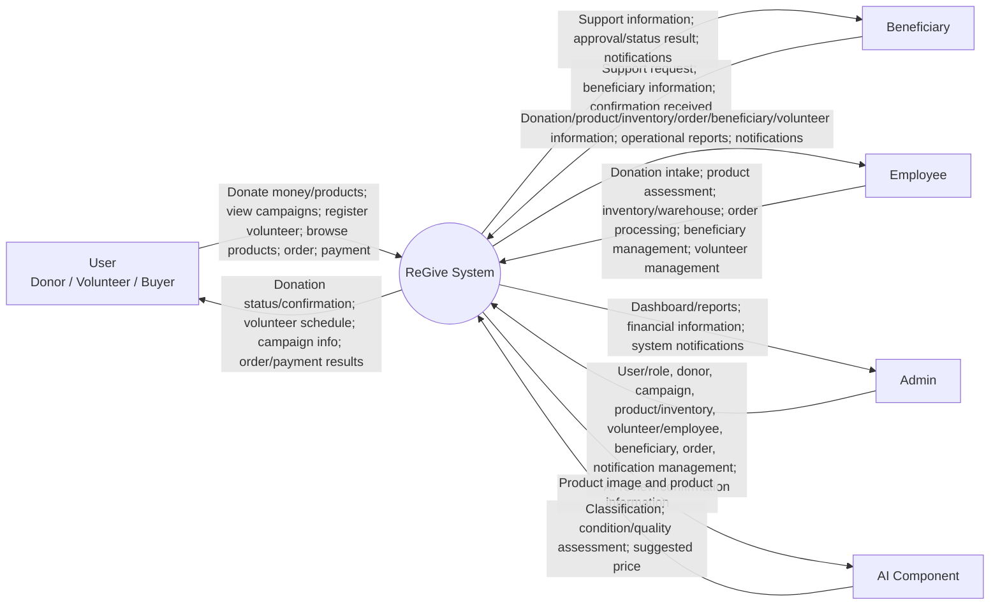

# ReGive: An AI-Assisted Charity and Second-hand Marketplace

> **Source:** Capstone Project 2 – Project Proposal, C2SE.17, ReGive, Version 1.1 (revision dated September 7, 2026).
>
> **Purpose of this Markdown file:** Convert the Word proposal into a structure that an AI coding assistant can read reliably and use as the **source of truth** when planning and implementing the project.
>
> **Conversion rule:** The product scope, roles, features, constraints, schedule, and technology stack below come from the proposal. Obvious spelling/formatting errors from the Word file are normalized for readability, but the project scope is not intentionally expanded.

---

# 0. Instructions for an AI Implementer

Use this document as the project-level source of truth.

- Do **not** invent business features that are not stated here unless the human team explicitly asks for them.
- Preserve the four main system actors defined by the proposal: **User**, **Beneficiary**, **Employee**, and **Admin**. The **AI component** is an external/supporting component, not a human role.
- The proposal defines **User** as covering three user types: **Donor, Volunteer, and Buyer**.
- AI may assist with donated-product classification, condition/quality assessment, and price recommendation, but important AI results must be reviewed and confirmed by an authorized **Admin or Employee** before being applied.
- The first implementation should follow the team's current technology decisions: **ReactJS frontend, Node.js (Express) backend, MongoDB, REST API, JWT, online payment gateway, GitHub**. *(Original proposal listed Java Spring Boot; the team has switched the backend to Node.js.)*
- The proposal is intended for the Vietnamese market. UI/content should therefore be compatible with Vietnamese language, locations, currency, and date conventions.
- Exact database schemas, API routes, payment provider, AI provider/model, UI design system, detailed RBAC matrix, validation rules, and deployment architecture are **not fully specified** in the proposal. Do not pretend they are fixed; derive them only when the team gives additional requirements.

## 0.1 Source inconsistencies that should not be silently “fixed” by an AI

The original proposal contains several inconsistencies or incomplete statements. Keep them visible and ask the project team when they affect implementation:

1. The project information table states **Start Date: 27 Aug 2026** and **End Date: 6 Dec 2026**, while the detailed master plan ends with **Final Release: 29 Oct 2026**.
2. The table of contents labels **Section 5 – Tasks and Deliverables**, while the body page labels the same section **“4. Tasks and Deliverable”** after Section 4 already exists. This Markdown normalizes it to **Section 5**.
3. Under Technical Constraints, the proposal contains the standalone sentence: **“These features are not available in the first version of the product.”** It does not clearly identify which features “these features” refers to. Do not infer the omitted list.
4. Some title text in the original Word file contains spelling errors such as “Chanrity” and “Marketplance”. This Markdown uses the intended spelling **Charity** and **Marketplace**.

---

# 1. AI-Oriented Project Brief

## 1.1 Product vision

ReGive is a centralized web-based platform that combines:

- charitable campaigns;
- monetary donations;
- product donations;
- volunteer participation;
- beneficiary support requests;
- donated-product intake and assessment;
- warehouse/inventory management;
- a second-hand marketplace;
- orders and payments;
- reporting and notifications;
- AI-assisted donated-product classification, condition/quality assessment, and price recommendation.

The system aims to improve transparency, traceability, convenience, and operational efficiency across charity and second-hand marketplace activities.

## 1.2 Main actors

| Actor | Meaning in the proposal | Main responsibility |
|---|---|---|
| User | Represents Donor, Volunteer, and Buyer | Donate, volunteer, browse/buy second-hand products, place orders, make payments, receive status/results |
| Beneficiary | Person requesting/receiving charitable support | Submit support requests, update information, track status, confirm support received |
| Employee | Operational staff | Donation intake, product assessment, warehouse/inventory, orders, beneficiary requests, volunteer coordination |
| Admin | Overall system manager | Users/roles, campaigns, donations, products, inventory, employees, volunteers, beneficiaries, orders, finance, reports, notifications, AI review |
| AI component | Supporting system component | Analyze product images/info, classify products, assess condition/quality, recommend price |

## 1.3 Core functional modules

An AI implementation plan should group source requirements into the following modules without adding new business scope:

1. **Authentication & User/Role Management**
2. **Charity Campaign Management**
3. **Monetary Donation Management**
4. **Product Donation & Donation Intake**
5. **Volunteer Registration & Scheduling**
6. **Beneficiary Support Request Management**
7. **Donated Product Assessment & Classification**
8. **Warehouse & Inventory Management**
9. **Second-hand Marketplace & Product Listing**
10. **Order Management**
11. **Payment Integration**
12. **Financial Information & Reporting**
13. **Notifications**
14. **AI-Assisted Product Analysis**
15. **Dashboards / Operational Reports**

These module names are an implementation-friendly regrouping of features explicitly stated throughout the proposal; they do not introduce new business capabilities.

## 1.4 AI-specific business rule

The AI component receives donated-product images and product information and can return:

- product classification;
- condition assessment;
- quality assessment;
- suggested second-hand price.

**Human-in-the-loop requirement:** AI output is not automatically authoritative. Important AI-generated results, especially condition and price recommendations, must be reviewed and confirmed by authorized Admins or Employees before approval or use in the system.

## 1.5 Recommended implementation sequence from the proposal's sprint plan

| Sprint | Source-defined scope |
|---|---|
| Sprint 1 | Authentication, campaigns, donations, volunteering, beneficiary support |
| Sprint 2 | Marketplace, products, orders, payments, warehouse/inventory, management functions |
| Sprint 3 | AI features, complete system integration, testing, refinement |

---

# 2. Project Information

| Field | Value |
|---|---|
| Project acronym | RG |
| Project title | ReGive: An AI-Assisted Charity and Second-hand Marketplace |
| Start date | 27 Aug 2026 |
| End date | 6 Dec 2026 |
| Lead institution | International School, Duy Tan University |
| Project mentor | MSc Huy, Truong Dinh |
| Scrum Master / Project Leader | Vu, Truong Van |
| Partner organization | Duy Tan University |
| Project Web URL | Not provided |

## 2.1 Team members

| Name | Email | Tel |
|---|---|---|
| Vu, Truong Van | vanvu283tg@gmail.com | 0898076047 |
| Anh, Nguyen Tuan | Tuananh883300@gmail.com | 0707426647 |
| Trung, Dinh Thanh | trungdinh104@gmail.com | 0869043585 |
| Chinh, Tran Duong | trduongchinh09092004@gmail.com | 0913891857 |
| Bao, Truong Ngoc Anh | bachiazed2k4dn@gmail.com | 0908220604 |

## 2.2 Document approvals

| Name | Student ID | Role |
|---|---:|---|
| Vu, Truong Van | 27211201694 | Scrum Master |
| Anh, Nguyen Tuan | 30219064323 | Team Member |
| Trung, Dinh Thanh | 27211240079 | Team Member |
| Chinh, Tran Duong | 28211126388 | Team Member |
| Bao, Truong Ngoc Anh | 28211102663 | Team Member |

## 2.3 Revision history

| Version | Date | Comments | Author |
|---|---|---|---|
| 1.0 | September 1, 2026 | Initial Release | C2SE_17 |
| 1.1 | September 7, 2026 | Update Solution | C2SE_17 |

---

# 3. Introduction

## 3.1 Purpose of Document

This document provides an overview of ReGive, a charity and second-hand marketplace platform, including its purpose, scope, main features, stakeholders, and expected outcomes.

It identifies the main business needs and challenges related to:

- charitable donations;
- volunteer participation;
- beneficiary support;
- donated-product management;
- inventory management;
- second-hand product trading.

The proposed online platform allows Users to:

- donate products or money;
- view and participate in charity campaigns;
- register as volunteers;
- browse and purchase second-hand products;
- place orders;
- make payments.

Beneficiaries can:

- submit support requests;
- provide necessary information;
- receive updates about support status.

Employees support daily operations, including:

- donation intake;
- product assessment;
- inventory and warehouse management;
- order processing;
- beneficiary support;
- volunteer coordination.

Admins are responsible for managing:

- users and roles;
- donations;
- campaigns;
- products;
- inventory;
- orders;
- beneficiaries;
- employees;
- volunteers;
- financial information;
- reports;
- system notifications.

The project integrates AI into product management. AI is used to analyze product images and information, assess the condition and quality of donated products, and suggest appropriate prices for second-hand products. AI-generated results are reviewed and confirmed by authorized staff before being applied to the system.

The proposal also covers the system architecture, technology stack, development methodology, project resources, implementation schedule, and estimated budget.

## 3.2 Project Goal

The goal of ReGive is to develop an online platform that connects people who want to contribute to the community with people who need charitable support.

The system allows Users to:

- donate money or products;
- participate in charity campaigns;
- register and join volunteer activities;
- purchase donated second-hand products through an integrated marketplace.

The system aims to improve the transparency and efficiency of charitable activities by providing clear information about:

- campaign goals;
- schedules;
- locations;
- donations;
- volunteer activities;
- beneficiary requests;
- support status.

It supports Employees in:

- handling donations;
- assessing products;
- managing inventory and warehouses;
- processing orders;
- coordinating volunteers and beneficiaries.

AI analyzes donated products based on product images and information, assesses quality and condition, and suggests suitable second-hand prices. AI-generated results are reviewed and confirmed by Admins or authorized staff before being used.

Overall, ReGive aims to create a centralized, transparent, and convenient platform that combines charitable activities with a second-hand marketplace, helping donated resources be managed effectively and reused to create greater social value.

---

# 4. Problem Definition

Charitable activities often face challenges in connecting donors, volunteers, beneficiaries, and people who want to support community campaigns.

Donors may not have a convenient platform to find suitable campaigns with clear goals, schedules, and locations. Potential volunteers may have difficulty finding suitable volunteer opportunities, registering for campaigns, and tracking volunteer schedules.

Managing charitable donations is also challenging, especially when organizations receive many donated products and monetary donations. Donated products need to be:

1. received;
2. classified;
3. assessed;
4. recorded;
5. stored, distributed to beneficiaries, or listed on the second-hand marketplace.

Without a centralized system, tracking donation information and product status can be time-consuming and may lead to inaccurate or duplicated data.

Managing warehouse inventory, orders, payments, and beneficiary support requests also requires coordination between Admins and Employees. Manual processes can make it difficult to:

- track product availability;
- process orders;
- manage beneficiary requests;
- coordinate volunteers;
- generate operational and financial reports.

Therefore, there is a need for a centralized web-based platform that integrates charitable donations, volunteer activities, beneficiary support, and second-hand shopping in one system.

ReGive also integrates AI to assist with:

- donated-product classification;
- condition assessment;
- quality assessment;
- price recommendation based on product images and information.

AI results are reviewed and confirmed by Admins or authorized Employees, reducing manual effort while maintaining human control over product information and pricing.

## 4.1 Business Need

The system should:

- Create a centralized platform connecting people who want to donate, volunteer, purchase second-hand products, and support charitable activities with charity organizations and beneficiaries.
- Allow Users to discover charity campaigns with clear goals, schedules, locations, and campaign information.
- Allow Users to register and participate as volunteers.
- Allow Users to donate money or products and track donation status and confirmations.
- Provide a second-hand marketplace where donated products can be assessed, listed, and purchased.
- Allow donated products to be reused while generating additional value for charitable activities.
- Allow Beneficiaries to submit support requests, provide beneficiary information, and track support status and approval results.
- Use AI to assist Employees in product classification, condition/quality assessment, and price recommendation based on images and product information.
- Allow authorized staff to review and confirm AI results.
- Provide Employees with tools for donation intake, product assessment, inventory, warehouse operations, order processing, beneficiary requests, and volunteer coordination.
- Provide Admins with centralized management for users/roles, donations, campaigns, products, inventory, volunteers, employees, beneficiaries, orders, payments, financial information, reports, and notifications.
- Improve efficiency, transparency, and traceability by centralizing information and reducing manual management.

## 4.2 Solution

ReGive provides a centralized web-based platform connecting Users, Beneficiaries, Employees, and Admins to support charitable activities and second-hand product reuse.

Users can:

- discover charity campaigns with clear goals, schedules, and locations;
- donate money or products to suitable campaigns;
- register and participate as volunteers;
- view volunteer schedules;
- browse and purchase suitable donated second-hand products.

Beneficiaries can submit support requests and track their request status.

The system provides an integrated second-hand marketplace where suitable donated products can be assessed, listed, and purchased. This supports product reuse and creates additional value for charitable activities.

AI is integrated to:

- analyze product images and information;
- classify products;
- assess condition and quality;
- recommend suitable prices.

AI results are reviewed and confirmed by Admins or authorized Employees before products are stored in a warehouse or listed on the marketplace.

Employees can manage:

- donation intake;
- product assessment;
- warehouse inventory;
- order processing;
- beneficiary requests;
- volunteer coordination.

Admins manage:

- users and roles;
- campaigns;
- donations;
- products;
- inventory;
- orders;
- beneficiaries;
- employees;
- volunteers;
- financial information;
- reports;
- system notifications.

Overall, the solution integrates donation management, volunteer activities, beneficiary support, AI-assisted product management, and second-hand shopping into one charity ecosystem.

---

# 5. Current Status of Art

Existing charity platforms and second-hand marketplaces generally provide useful services for either charitable activities or product trading. However, they often focus on one area and do not provide an integrated solution combining donations, volunteer activities, beneficiary support, second-hand shopping, warehouse management, and AI-assisted product assessment.

## 5.1 Feature comparison

| Feature | ReGive | Charity Platforms | Second-hand Marketplaces |
|---|---:|---:|---:|
| User Account | ✓ | ✓ | ✓ |
| Monetary Donation | ✓ | ✓ | ✗ |
| Product Donation | ✓ | Some | ✗ |
| Charity Campaign | ✓ | ✓ | ✗ |
| Volunteer Registration | ✓ | ✓ | ✗ |
| Second-hand Marketplace | ✓ | Some | ✓ |
| Order Management | ✓ | Some | ✓ |
| Payment | ✓ | ✓ | ✓ |
| Warehouse Management | ✓ | Some | ✓ |
| AI Product Classification | ✓ | ✗ | ✗ |
| AI Condition Assessment | ✓ | ✗ | ✗ |
| AI Price Recommendation | ✓ | ✗ | Some |
| Integrated Charity + Marketplace | ✓ | Limited | ✗ |

## 5.2 Intended improvements

ReGive aims to improve on existing solutions by:

- **Connecting donation and volunteering:** Users can discover campaigns with specific goals, schedules, and locations, then donate money/products or register as volunteers.
- **Supporting beneficiaries:** Beneficiaries can submit support requests, provide necessary information, and track support status.
- **Combining charity with second-hand shopping:** Suitable donated products can be listed and purchased, supporting reuse and charitable activities.
- **Applying AI to donated products:** AI assists Employees/Admins in classification, condition/quality assessment, and price recommendation; authorized staff review the results.
- **Centralizing operational management:** Users/roles, donations, campaigns, products, inventory, orders, beneficiaries, volunteers, employees, payments, reports, and notifications are managed centrally.
- **Improving transparency and traceability:** Donation, product, inventory, order, volunteer, and beneficiary information are tracked in one system.
- **Providing an integrated experience:** Users do not need separate platforms for charity participation and second-hand shopping.

---

# 6. Engineering Approach

## 6.1 System Context Diagram

The original proposal contains a context diagram with ReGive at the center and five external actors/components: User, Beneficiary, Employee, Admin, and AI.

The following Mermaid diagram is a **textual reconstruction from the proposal's context diagram and context description** for AI readability. It does not add new actors.

## 6.2 System Context Description

### 6.2.1 User

The User represents three user types: **Donor, Volunteer, and Buyer**.

Users can:

- donate money or products through the system;
- view available charity campaigns and campaign information;
- register and participate in charity campaigns as volunteers;
- view volunteer schedules and campaign participation status;
- browse available second-hand products and view product details;
- place orders for second-hand products through the marketplace;
- make payments for donations or product purchases;
- receive donation confirmations, volunteer schedules, campaign information, and order/payment results.

### 6.2.2 Beneficiary

Beneficiaries can:

- submit support requests through the system;
- provide and update beneficiary information;
- view the status of submitted support requests;
- confirm that charitable support has been received;
- receive support information, approval results, and system notifications.

### 6.2.3 Employee

Employees support daily operational activities and can:

- receive and record donated products;
- assess and classify donated products;
- manage product and donation information;
- manage warehouse inventory and product storage;
- process and manage customer orders;
- manage beneficiary requests and related information;
- manage and coordinate volunteers and volunteer schedules;
- view operational information, reports, and system notifications.

### 6.2.4 Admin

Admins manage and monitor the overall system and can:

- manage users and user roles;
- manage donors and donation information;
- manage charity campaigns;
- manage products and inventory;
- manage volunteers and employees;
- manage beneficiary information and support activities;
- manage orders and marketplace operations;
- monitor dashboards and generate reports;
- manage and view financial information;
- manage system notifications;
- review and confirm AI-generated product assessment and price recommendation results.

### 6.2.5 AI Component

The AI component can:

- receive product images and product information from the system;
- analyze product images and provided product information;
- classify donated products based on their characteristics;
- assess the condition and quality of donated products;
- recommend suitable prices for second-hand products;
- return product classification, condition assessment, and price recommendation results to the system.

## 6.3 Technical Constraints

### Development technologies

| Category | Technology / Constraint |
|---|---|
| Programming languages | JavaScript |
| Frontend | ReactJS |
| Backend | Node.js (Express.js) |
| Libraries / Frameworks | React Hooks, Redux, React Hook Form, Material UI; Express, Mongoose, JWT |
| AI | AI model/API for product classification, condition assessment, and price recommendation |
| Database | MongoDB |
| API communication | RESTful API |
| Authentication | JWT |
| Payment | Online Payment Gateway |
| Version control | GitHub |
| Team management | Trello, Zalo, Google Drive |
| Development tools | Visual Studio Code, Postman |

### Environment

- Internet connection is required for the web application, AI services, and online payment services.
- Supported web browsers named in the proposal: Google Chrome, Microsoft Edge, Firefox, and Cốc Cốc.
- Operating system: Windows or other operating systems that support the required development environment.

### Other constraints

- Resource: **5 people**.
- Budget: **Limited**.
- Time: project must be completed within **03 months**.
- Original proposal statement: **“These features are not available in the first version of the product.”** The referenced feature list is not identified in the source text.

---

# 7. Tasks and Deliverables

> Note: The Word body labels this section “4. Tasks and Deliverable”, but the table of contents identifies it as Section 5. This Markdown uses Section 7 because earlier sections have been expanded for AI readability while preserving the source sequence.

## 7.1 Project Development Tasks and Activities

| No. | Task name | Description |
|---:|---|---|
| 1 | Project Start-up | Establish the project, clarify objectives, requirements, stakeholders, scope, and development plan. |
| 1.1 | Project Kick-off Meeting | Clarify project objectives, scope, roles, responsibilities, and initial requirements with stakeholders. |
| 1.2 | Project Discussion | Refine the ReGive concept, business requirements, target users, and main system features. |
| 1.3 | Project Documentation | Prepare the Proposal, User Stories, Product Backlog, Project Plan, System Context Diagram, and other project artifacts. |
| 2 | Development | Develop the ReGive system using the Agile/Scrum methodology. |
| 2.1 | Sprint Planning | Define sprint goals, prioritize backlog items, estimate tasks, and prepare sprint plans. |
| 2.2 | Sprint 1 | Develop core functions including authentication, campaigns, donations, volunteering, and beneficiary support. |
| 2.3 | Sprint 2 | Develop marketplace, products, orders, payments, warehouse/inventory, and management functions. |
| 2.4 | Sprint 3 | Integrate AI features and complete system integration, testing, and refinement. |
| 3 | Project Review & Preparation | Review the system, perform final testing, complete documentation, and prepare the final presentation. |
| 4 | Final Release | Release the completed ReGive system and deliver the required source code and project documentation. |

---

# 8. Project Management

## 8.1 Cost / Budget for Project

### Cost per person/hour

| Full Name | Role | Salary Rate (USD/hour) |
|---|---|---:|
| Vu, Truong Van | Scrum Master | 2 |
| Anh, Nguyen Tuan | Team Member | 2 |
| Trung, Dinh Thanh | Team Member | 2 |
| Chinh, Tran Duong | Team Member | 2 |
| Bao, Truong Ngoc Anh | Team Member | 2 |

### Total cost estimation

| No. | Criteria | Price | Total (USD) |
|---:|---|---:|---:|
| 1 | Working hours | 2 | 2700 |
| 2 | Other cost | 100 | 500 |
|  | **Total** |  | **3200** |

### Description

| Description | Amount | Unit |
|---|---:|---|
| Number of members | 5 | Person |
| Number of working hours per day | 3 | Hours |
| Cost per hour per member | 2 | USD |
| Number of working days | 90 | Days |

Calculation from the proposal:

- Amount of working hours = 5 members × 3 hours × 90 days.
- Other cost = 5 members × 100 USD.

## 8.2 Tentative Schedule

### 8.2.1 Master Plan

| No. | Task Name | Duration | Start | Finish |
|---:|---|---|---|---|
| 1 | Initial | 8 days | 27-Aug-2026 | 03-Sep-2026 |
| 1.1 | Gathering Requirement | 2 days | 27-Aug-2026 | 28-Aug-2026 |
| 1.2 | Create Proposal Document | 6 days | 29-Aug-2026 | 03-Sep-2026 |
| 2 | Start Up | 10 days | 04-Sep-2026 | 13-Sep-2026 |
| 2.1 | Project Kick-off Meeting | 2 days | 04-Sep-2026 | 05-Sep-2026 |
| 2.2 | Create Document | 8 days | 06-Sep-2026 | 13-Sep-2026 |
| 3 | Development | 42 days | 14-Sep-2026 | 25-Oct-2026 |
| 3.1 | Sprint 1 | 14 days | 14-Sep-2026 | 27-Sep-2026 |
| 3.2 | Sprint 2 | 14 days | 28-Sep-2026 | 11-Oct-2026 |
| 3.3 | Sprint 3 | 14 days | 12-Oct-2026 | 25-Oct-2026 |
| 4 | Project's Retrospective Meeting | 3 days | 26-Oct-2026 | 28-Oct-2026 |
| 5 | Final Release | 1 day | 29-Oct-2026 | 29-Oct-2026 |

### 8.2.2 Scrum Process

The proposal describes Scrum as:

- an iterative and incremental agile software development framework for managing software projects and product/application development;
- suitable for environments where it is difficult to plan far ahead;
- based on empirical process control and feedback loops rather than traditional command-and-control management;
- an approach that brings decision-making authority closer to operational work and certainty.

Benefits listed in the proposal:

- Project can respond easily to change.
- Problems are identified early.
- Customers get the most beneficial work first.
- Work done will better meet the customer's needs.
- Improved productivity.
- Ability to maintain a predictable schedule for delivery.

---

# 9. Project Constraints and Acceptance Criteria

## 9.1 Economic

**Constraint description**

The project has a limited budget. The team should prioritize free or low-cost technologies, development tools, cloud services, and AI services. Potential costs include:

- hosting;
- database storage;
- AI API usage;
- domain services;
- payment gateway fees.

**Acceptance guideline**

The project should be developed within the approved budget. Free or low-cost services should be prioritized while ensuring that all core system functions can be implemented and demonstrated effectively.

## 9.2 Environmental

**Constraint description**

ReGive is web-based and does not directly create significant environmental impacts. Unnecessary server processing, storage, and data transfer should be minimized.

**Acceptance guideline**

The system should use computing and storage resources efficiently. Unnecessary data, duplicate files, and excessive processing should be avoided where possible.

## 9.3 Ethical

**Constraint description**

The system handles:

- personal information;
- donation information;
- payment-related information;
- beneficiary information;
- user activities.

These data must be protected and accessed only for authorized purposes. AI-generated results should support decision-making rather than automatically making critical decisions.

**Acceptance guideline**

- User and beneficiary data must be securely stored and handled according to access-control rules.
- Important AI-generated results, especially product condition and price recommendations, must be reviewed by authorized Admins or Employees before approval.

## 9.4 Public Health, Safety, and Welfare

**Constraint description**

ReGive supports charitable activities and reuse of second-hand products. Incorrect product information or inappropriate products may negatively affect users. Products that are damaged, unsafe, or unsuitable for resale should not be approved for the marketplace.

**Acceptance guideline**

- Product information should be reviewed before products are listed for sale.
- Users should receive clear information about product condition, campaign information, prices, orders, and support status.

## 9.5 Social and Global

**Constraint description**

The system aims to encourage charitable participation through:

- monetary donations;
- product donations;
- volunteering;
- beneficiary support;
- second-hand shopping.

It should provide equal and convenient access to the main services for different types of users.

**Acceptance guideline**

Users should be able to easily:

- discover campaigns;
- donate;
- register as volunteers;
- request or receive support;
- purchase second-hand products through a centralized platform.

## 9.6 Cultural

**Constraint description**

ReGive is primarily designed for the Vietnamese market and should consider:

- Vietnamese language;
- local locations;
- date formats;
- currency;
- donation practices;
- community-based charitable activities.

**Acceptance guideline**

The interface and system information should be understandable to Vietnamese users. The system should support Vietnamese locations, Vietnamese currency, appropriate date formats, and locally relevant campaign information.

## 9.7 Sustainability

**Constraint description**

The project is developed by a team of five members and uses technologies including ReactJS, Node.js (Express), and MongoDB. The system should have a modular architecture that allows the team to maintain existing functions and add new features later.

**Acceptance guideline**

The system should use:

- maintainable architecture;
- reusable components;
- clear coding practices;
- sufficient technical documentation.

The design should allow future extensions such as additional charity services, marketplace functions, and AI capabilities.

---

# 10. Conclusion

ReGive aims to provide one centralized platform connecting:

- charitable activities;
- volunteer participation;
- beneficiary support;
- second-hand shopping.

Users can donate money/products, discover and participate in charity campaigns, register as volunteers, and purchase donated second-hand products.

Employees and Admins can manage donations, products, warehouse inventory, volunteers, beneficiaries, campaigns, orders, payments, and other operational activities.

AI assists with donated-product classification, condition/quality assessment, and price recommendation, with results reviewed by authorized Admins or Employees.

The expected outcome is a convenient, transparent, and meaningful platform that encourages charitable participation, promotes reuse of donated products, and creates greater social value for the community.

---

# 11. References from the Proposal

1. The Scrum Guide — https://scrumguides.org/
2. React Documentation
3. Node.js / Express Documentation
4. MongoDB Documentation
5. GitHub Documentation
6. REST API Documentation — MDN Web Docs
7. JWT Documentation — JSON Web Tokens
8. IEEE Software Engineering Standards — IEEE Computer Society standards and software engineering resources
9. ISO/IEC/IEEE 12207 — Systems and software engineering — Software life cycle processes
10. *(Historical)* Spring Boot was listed in the original proposal; implementation uses Node.js instead.

---

# 12. Requirement Checklist for AI Implementation

This checklist is a compact, source-derived index. It is useful when asking an AI coding tool to implement the system incrementally.

## 12.1 User-facing requirements

- [ ] User account/authentication with JWT-based authentication at system level.
- [ ] View charity campaigns and campaign information.
- [ ] Donate money.
- [ ] Donate products.
- [ ] Track donation status / receive donation confirmations.
- [ ] Register as a volunteer for campaigns.
- [ ] View volunteer schedules and participation status.
- [ ] Browse second-hand products.
- [ ] View product details.
- [ ] Place orders.
- [ ] Make payments for donations and/or product purchases.
- [ ] Receive order/payment results.

## 12.2 Beneficiary requirements

- [ ] Submit support requests.
- [ ] Provide/update beneficiary information.
- [ ] View support-request status.
- [ ] Receive approval/support results and notifications.
- [ ] Confirm support has been received.

## 12.3 Employee requirements

- [ ] Receive and record donated products.
- [ ] Assess and classify donated products.
- [ ] Manage product and donation information.
- [ ] Manage warehouse inventory/product storage.
- [ ] Process/manage customer orders.
- [ ] Manage beneficiary requests/information.
- [ ] Coordinate volunteers and volunteer schedules.
- [ ] View operational information/reports/notifications.

## 12.4 Admin requirements

- [ ] Manage users and roles.
- [ ] Manage donors and donation information.
- [ ] Manage charity campaigns.
- [ ] Manage products and inventory.
- [ ] Manage volunteers and employees.
- [ ] Manage beneficiaries and support activities.
- [ ] Manage orders and marketplace operations.
- [ ] View dashboards and generate reports.
- [ ] Manage/view financial information.
- [ ] Manage system notifications.
- [ ] Review/confirm AI-generated product assessment and price recommendations.

## 12.5 AI requirements

- [ ] Receive product images and product information.
- [ ] Analyze image + provided product information.
- [ ] Classify donated products.
- [ ] Assess condition.
- [ ] Assess quality.
- [ ] Recommend second-hand price.
- [ ] Return AI results to ReGive.
- [ ] Require authorized human review for important AI results before approval/application.

## 12.6 Technical / quality requirements

- [ ] Frontend: ReactJS.
- [ ] Backend: Node.js (Express).
- [ ] Database: MongoDB.
- [ ] API style: RESTful API.
- [ ] Authentication: JWT.
- [ ] Payment: online payment gateway.
- [ ] Version control: GitHub.
- [ ] Use modular, maintainable architecture.
- [ ] Use reusable frontend/backend components where appropriate.
- [ ] Protect personal, beneficiary, donation, and payment-related information.
- [ ] Enforce authorized access to sensitive data and functions.
- [ ] Review product information before marketplace listing.
- [ ] Do not approve damaged/unsafe/unsuitable products for resale.
- [ ] Support Vietnamese market conventions.
- [ ] Minimize unnecessary storage, duplicate files, and excessive processing.
- [ ] Keep technical documentation sufficient for maintenance and future extension.

---

# 13. Items the Proposal Does NOT Fully Specify

An AI implementer should treat the following as design decisions requiring a team decision, a Product Backlog/User Story document, or additional requirements before finalizing behavior:

- Exact registration/login/forgot-password flows and fields.
- Exact user-role hierarchy and permission matrix between Donor, Volunteer, Buyer, Employee, Admin, and Beneficiary accounts.
- Whether one account can act as multiple User subtypes simultaneously.
- Campaign creation fields, statuses, lifecycle, and approval workflow.
- Donation data fields and exact status workflow.
- Product-donation intake workflow and detailed product statuses.
- Warehouse model, warehouse locations, stock movement rules, and inventory transaction structure.
- Marketplace product categories, search/filter/sort rules, cart behavior, shipping/delivery flow, cancellation/refund flow.
- Order state machine.
- Payment provider, callback/webhook behavior, reconciliation, refunds, and failure handling.
- Beneficiary eligibility criteria, approval workflow, supporting-document rules, and privacy details.
- Volunteer capacity, shifts, attendance/check-in, cancellation, and qualification rules.
- Exact notification channels (in-app, email, SMS, etc.).
- Exact dashboard KPIs and report formats.
- Exact AI provider/model, confidence thresholds, prompt/model versioning, retraining/fine-tuning, and fallback behavior.
- Exact criteria used for product condition/quality scores and final pricing formula.
- File/image storage provider and image limits.
- Exact UI/UX design, routing, page structure, responsive breakpoints, and accessibility target.
- Exact API endpoint names, request/response schemas, error codes, pagination standard, and API versioning.
- MongoDB collection/document schemas and indexes.
- Deployment/hosting provider, CI/CD pipeline, environment strategy, monitoring, logging, and backups.
- Automated testing strategy and required coverage.

These items are intentionally listed as **unspecified**, not as new requirements.

